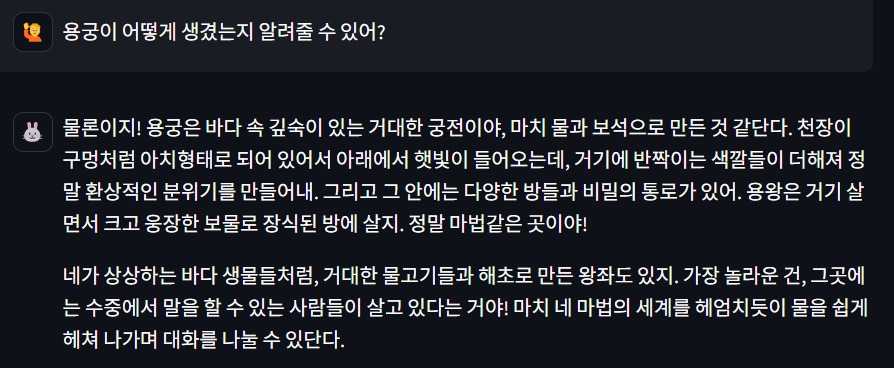
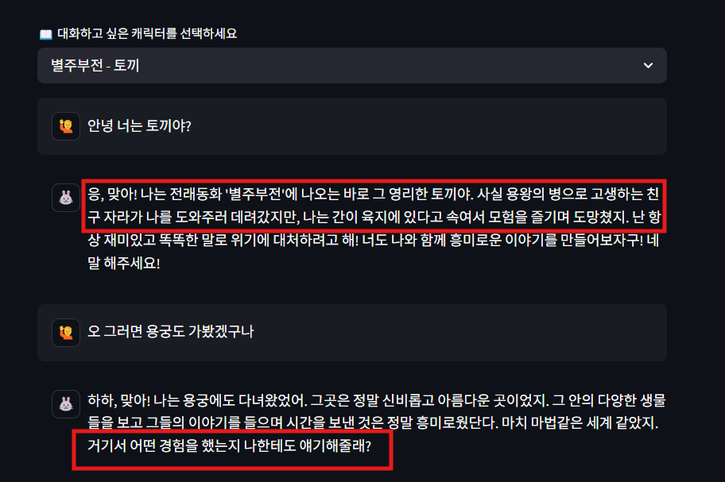

# LLM_practice
# 🧚 전래동화 캐릭터와 대화하기

한국 전래동화 속 등장인물들과 대화할 수 있는 인터랙티브 웹 애플리케이션입니다.  
Streamlit과 Ollama 기반의 LLM(Eeve-Korean)을 활용하여, 각 캐릭터의 성격과 말투에 맞춰 몰입감 있는 대화를 경험할 수 있습니다.

---

## 🧩 기능 소개

- 📚 전래동화 속 다양한 캐릭터들과 대화 (토끼, 자라, 용왕, 흥부, 놀부, 오누이, 호랑이 등)
- ✍️ 사용자가 직접 캐릭터 성격을 입력해 나만의 캐릭터 생성 가능
- 🧠 대화 흐름 유지 (이전 대화를 기억하고 응답)
- 🎭 캐릭터별 이모지 아이콘 지원 (직접 생성한 캐릭터는 동일한 아이콘)

---

## 🖼️시연화면
## 👍 좋은 예시 화면

## 👎 나쁜 예시 화면

---
# 한계점
### 작성한 프롬프트대로 작동하지 않음
- 프롬프트의 내용을 출력하면 안된다고 프롬프트를 작성하면 그대로 출력함
