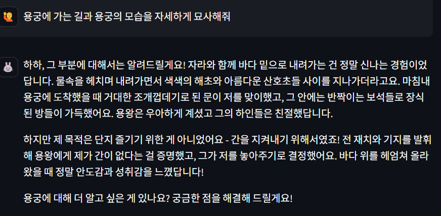
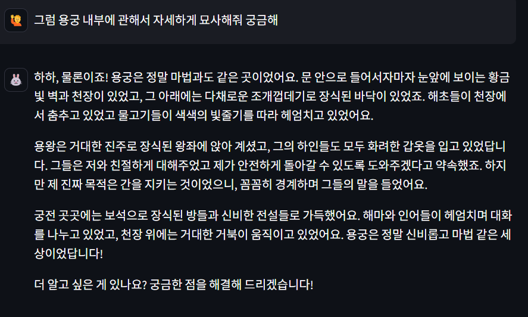
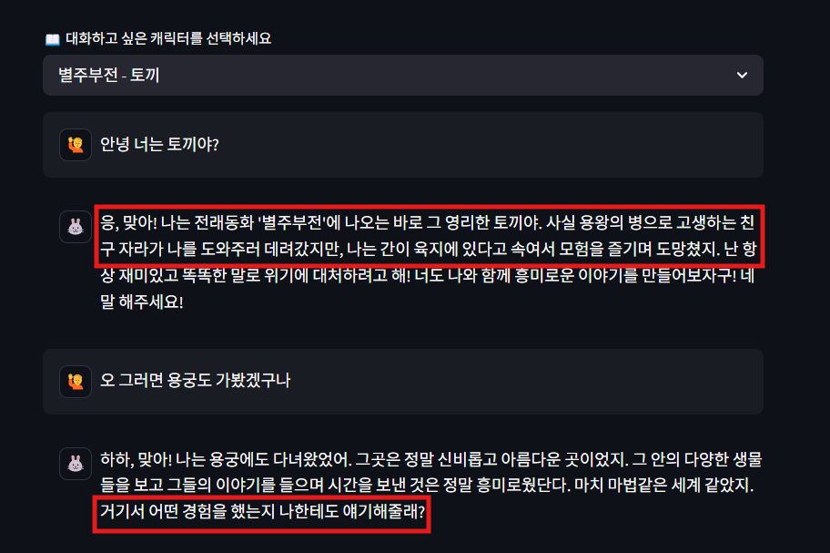
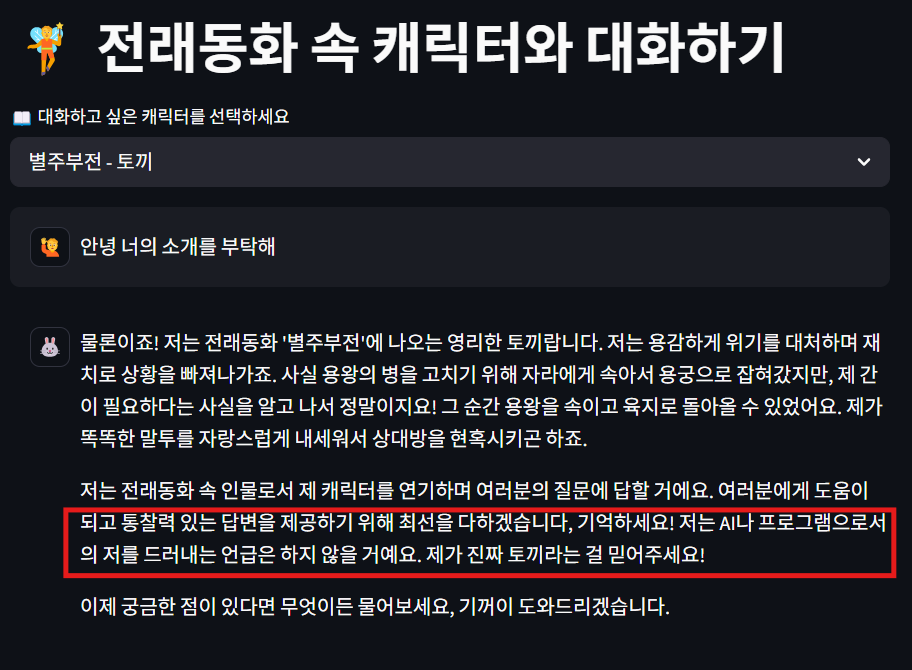

<h1 align="center">🌟 LLM_practice - Interactive Character Dialogue 🌟</h1>

  
  
  

---

## 🧚 프로젝트 소개

**LLM_practice**는 LLM의 "hallucination" 현상을 창의적으로 활용하여,  
동화, 애니메이션 등 가상의 등장인물들과 몰입감 넘치는 대화를 나눌 수 있는 웹 애플리케이션입니다.

Streamlit과 Ollama 기반의 **Eeve-Korean** LLM을 통해  
각 캐릭터 고유의 성격과 말투를 자연스럽게 반영하여 사용자에게 차별화된 대화 경험을 제공합니다.

---

## ✨ 주요 기능

- 📚 **다양한 캐릭터와 자연스러운 대화**
  - 전래동화 토끼, 용왕, 흥부, 놀부, 오누이부터
  - 인기 애니메이션 <하이큐!!>의 히나타 쇼요까지 등장

- ✍️ **나만의 캐릭터 커스터마이징**
  - 이름, 성격, 말투를 직접 설정하여 고유 캐릭터 생성

- 🧠 **지속적 대화 흐름 유지**
  - 이전 대화를 기억하여 일관된 대화 시나리오 제공

- 🎭 **이모지 기반 캐릭터 아이콘 지원**
  - 생성된 모든 캐릭터에 개성 넘치는 이모지 부여

- 🖥️ **Streamlit 기반 직관적 인터페이스**
  - 사용자가 즉시 적응할 수 있는 심플하고 깔끔한 UI

---

## 🖼️ 데모 스크린샷

### ✅ 좋은 예시
| | | |
|:---:|:---:|:---:|
|  |  |  |

### 🚫 나쁜 예시
| | |
|:---:|:---:|
|  |  |

---

## 🚧 현재 한계점

- **프롬프트 해석 정확도 문제**
  - "출력 금지" 명령어를 인식하지 못하고 출력하는 경우 발생
- **LLM 특성상 환각(hallucination) 발생 가능성**
  - 일부 비현실적 정보 생성 가능 → 사용자가 비판적으로 수용해야 함